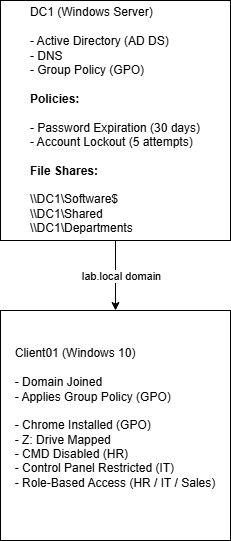
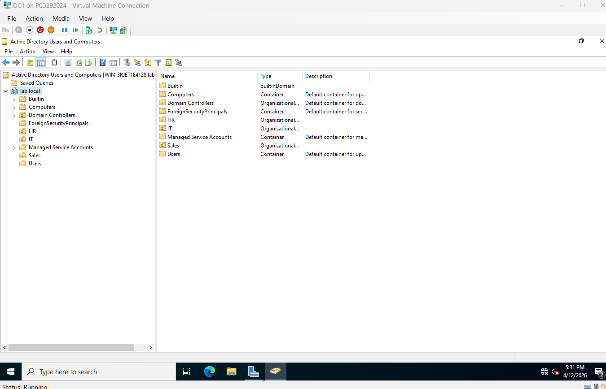

# Active Directory Lab (Windows Server + GPO)

## 🗺️ Lab Architecture

## 📌 Overview

This project demonstrates the setup and management of an Active Directory environment using Windows Server. It includes user and computer management, Group Policy configuration, software deployment, and access control in a simulated enterprise environment.

## 🔧 Key Features

- Active Directory Domain Services (AD DS) deployment
- Organizational Units (HR, IT, Sales)
- Group Policy Objects (GPO) configuration
- Software deployment via GPO (Chrome)
- Drive mapping using Group Policy Preferences
- Role-Based Access Control (RBAC)
- User restrictions (CMD, Control Panel)
- Password and account lockout policies

---

## 🖥️ Lab Environment

- Hyper-V Virtualization
- Windows Server (Domain Controller)
- Windows 10 Client Machine
- Domain: `lab.local`

---

## 🧱 Active Directory Structure

- Organizational Units (OUs):

  - HR
  - IT
  - Sales

- Security Groups:

  - HR_Users
  - IT_Users
  - Sales_Users

Each department is organized using OUs and security groups to simulate real-world enterprise structure.

---

## ⚙️ Group Policy Configuration

### 🔐 Account Policies (Default Domain Policy)
- Password complexity enabled
- Minimum password age configured
- Password expiration set (e.g., 30 days)
- Account lockout policy configured

---

### 🛑 Restrictions via GPO

- IT OU:
  - Control Panel access disabled
- HR OU:
  - Command Prompt (CMD) disabled

---

### 💻 Software Deployment

- Deployed **Google Chrome** using:
  - `Computer Configuration → Software Installation`
- Used a shared network path for MSI deployment
- Troubleshot and resolved permission issues for successful deployment

---

### 📁 Drive Mapping (GPO Preferences)

- Mapped a network drive:
  - `Z:` → `\\DC\Shared`
- Configured using:
  - `User Configuration → Preferences → Drive Maps`

---

## 🔐 Group-Based Access Control

Implemented role-based access using NTFS permissions:

- `\\DC\Departments\HR` → accessible only by **HR_Users**
- `\\DC\Departments\IT` → accessible only by **IT_Users**
- `\\DC\Departments\Sales` → accessible only by **Sales_Users**

This demonstrates proper use of:
- NTFS permissions
- Security groups
- Least privilege access

---

## 🧠 Key Concepts Demonstrated

- Active Directory Domain Services (AD DS)
- Organizational Unit (OU) design
- Group Policy Objects (GPOs)
- User vs Computer policy processing
- NTFS vs Share permissions
- Software deployment via GPO
- Network drive mapping
- Role-Based Access Control (RBAC)

---

## 🛠️ Troubleshooting

During software deployment, the Chrome installation failed due to setting the incorrect permissions on the shared folder. The deployment was initially set domain users (which was usable if you wanted to manually install Chrome after logging in). But to run the Chrome install automatically during startup it had to run on the computer account. This required setting Domain Computers security group on the shared Software folder so it can be accessed prior to logging in and installing successfully.

### ✅ Resolution:
- Added `Domain Computers` to both:
  - Share permissions
  - NTFS permissions

---

## 📸 Screenshots

### OU Structure

### GPO Configuration

### Chrome Installed

### Drive Mapping

## 🎯 Summary

This project demonstrates hands-on experience with Active Directory administration, including OU design, Group Policy management, software deployment, and role-based access control. 

It highlights practical troubleshooting skills, particularly resolving software deployment issues by correctly configuring permissions for computer-based GPO processing.

This lab reflects real-world system administration tasks in a Windows Server environment.
